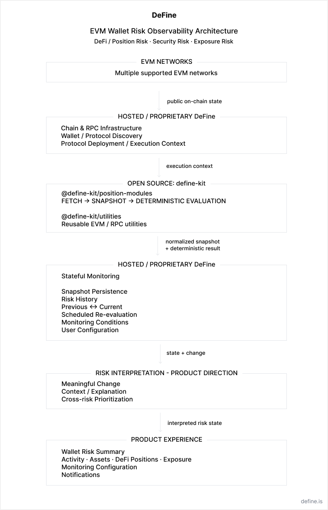

# DeFine Architecture & Technical Overview

DeFine is a wallet-level risk observability and early-warning system for self-custodial EVM users.

The system analyzes wallet, blockchain, and protocol state, evaluates supported risks, and maintains historical state so that risk can be observed over time rather than only at a single point.

DeFine's broader product direction spans three wallet-risk domains:

**DeFi / Position Risk · Security Risk · Exposure Risk**

**DeFi / Position Risk** covers risks arising from DeFi positions and protocol state. **Security Risk** covers wallet security signals such as permissions, unusual transfers, and suspicious activity. **Exposure Risk** covers risk arising from external entities, counterparties, funds, or risk-intelligence signals, such as sanctions or other high-risk exposure.

The product direction is centered on one question:

> **What in this wallet needs attention right now, and why?**

DeFine combines wallet and risk information into a wallet-level view where users can inspect their activity, assets, DeFi positions, and risk state, while the Risk Summary is designed to surface what deserves attention first.

DeFine is designed around a progression from risk signals to risk state, meaningful change, context, prioritization, and user attention.

## System Architecture



## Current Implementation

DeFine already includes an EVM wallet and protocol analysis foundation covering chain access, wallet activity, asset discovery, contract identification, and protocol interaction discovery.

Aave V3 Health Factor is currently the first fully integrated risk module and the most mature implementation of DeFi / Position Risk.

For an Aave V3 position, the module reads protocol state directly, captures protocol-reported position data including Health Factor, and applies deterministic risk evaluation to that state.

The module produces an explicit, serializable snapshot and evaluates that snapshot deterministically. The resulting data can then be persisted and compared with later observations.

The existing implementation includes:

- real Aave V3 position reads and Health Factor risk evaluation;
- block-pinned risk snapshots containing block number and block hash;
- persisted historical risk snapshots;
- previous-versus-current state;
- scheduled risk re-evaluation;
- persisted monitoring state;
- user-configurable Health Factor monitoring thresholds;
- RPC health and multi-endpoint infrastructure.

Security Risk, Exposure Risk, wallet-level interpretation, cross-risk prioritization, and the broader Risk Summary remain product-direction/prototype work rather than equivalent production integrations today.

## Why the Architecture Is Stateful

A single blockchain read can answer:

> **What is the position state now?**

It cannot by itself answer:

> **What changed?**

DeFine therefore stores selected risk snapshots and monitoring state over time.

For example, two individually valid Aave observations become more useful when the system can determine that Health Factor moved from one value to another, whether a configured condition changed state, and when that transition occurred.

Snapshots are tied to blockchain observations through block metadata. This gives historical observations a concrete chain context instead of treating them as unversioned application values.

The architecture also separates risk evaluation from stateful monitoring.

A risk module can evaluate one snapshot without needing access to DeFine's database, scheduler, notification system, or previous observations. The hosted application is responsible for storing and comparing those observations over time.

This separation makes the protocol-facing logic easier to inspect, test, reuse, and extend.

## Open-Core Boundary

DeFine uses an intentional open-core architecture.

### Open Source: define-kit

[`define-kit`](https://github.com/Aleksandern/define-kit) contains reusable protocol-risk and EVM infrastructure that can be used independently of the hosted DeFine application.

Its current packages include:

#### `@define-kit/position-modules`

Protocol-specific position modules following the execution model:

```text
fetch protocol state
        ↓
build serializable snapshot
        ↓
evaluate snapshot deterministically
        ↓
return snapshot + result
```

The current package includes the Aave V3 Health Factor adapter.

#### `@define-kit/utilities`

Reusable EVM infrastructure utilities, currently including RPC endpoint health checks and related helpers.

The public modules intentionally do not own application persistence, scheduling, notification delivery, or UI state.

**Source and documentation:**

- [define-kit on GitHub](https://github.com/Aleksandern/define-kit)
- [define-kit Technical README](https://github.com/Aleksandern/define-kit/blob/main/README.md)

### Hosted DeFine

The hosted DeFine service remains proprietary.

It provides the application and runtime layer around reusable risk components, including wallet and protocol discovery, persistence, historical state, previous/current comparison, scheduled execution, monitoring conditions, user configuration, notification infrastructure, UI, and multi-network service operation.

This boundary allows reusable protocol-facing risk logic to remain inspectable and reusable without requiring the complete hosted product and operational infrastructure to be open source.

## EVM Network Integration

DeFine is designed around EVM chain identifiers and chain-specific RPC and protocol configuration rather than a single-network architecture.

Adding an EVM network does not require a separate risk architecture. Network-specific RPC and protocol configuration plug into the same discovery, risk-evaluation, persistence, and monitoring layers.

DeFine currently supports multiple EVM networks through its shared chain infrastructure. Network support and protocol/risk coverage are separate concerns: adding a network to the infrastructure does not imply that every risk module or protocol is available on that network.

DeFine does not currently require a project-owned smart contract for this architecture. It primarily reads and analyzes public on-chain state off-chain.

## Extending DeFine

The architecture separates network and data access, risk evaluation, and stateful monitoring.

**Network and data access** provides blockchain state, wallet activity, protocol data, and other inputs required by supported risk evaluations.

**Risk evaluation** converts supported inputs into structured risk observations. For protocol-position risks, `define-kit` provides reusable modules that fetch protocol state, create serializable snapshots, and evaluate them deterministically. Other risk domains may use different inputs or evaluation models.

**The hosted monitoring layer** provides persistence, historical comparison, scheduled execution, monitoring conditions, user configuration, and product delivery.

This separation allows DeFine to add new risk evaluations without rebuilding the surrounding history and monitoring infrastructure. A new protocol-position module can reuse the existing `define-kit` execution model, while other risk domains can provide structured risk observations through their own evaluation paths.

Similarly, adding another EVM network primarily requires network support and valid protocol/network configuration rather than a separate product architecture.

Different risk domains can require different data sources and evaluation models; not every risk originates from protocol state.

## From Risk Observations to Wallet-Level Risk

The existing architecture establishes supported risk observations and maintains their state over time. The broader product direction builds on this foundation by adding context and prioritization across the wallet.

The intended progression is:

```text
risk observation
        ↓
historical state / change
        ↓
context / explanation
        ↓
prioritization
        ↓
Wallet Risk Summary / user action
```

The Wallet Risk Summary is designed to provide a prioritized view of what currently requires attention, while users can also inspect underlying wallet activity, assets, DeFi positions, exposure information, and historical risk state.

Exposure Risk can use intelligence from specialized external sources, public datasets, or future open-source exposure-evaluation components as inputs to DeFine's risk evaluation and monitoring architecture.

## Technical References

### DeFine

- [Product](https://define.is)
- [Application](https://app.define.is)

### Open-Source Infrastructure

- [define-kit](https://github.com/Aleksandern/define-kit)
- [define-kit Technical README](https://github.com/Aleksandern/define-kit/blob/main/README.md)

The `define-kit` repository contains the public implementation and package-level documentation for the reusable risk-module boundary described above.
